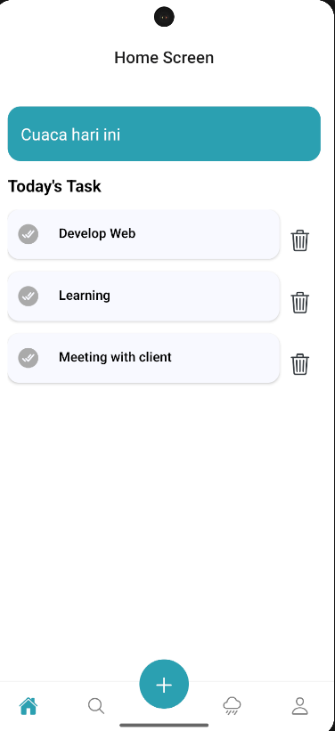
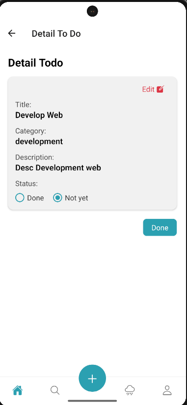
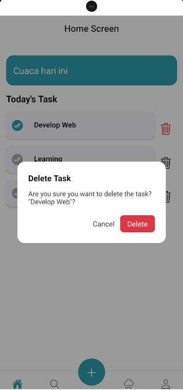
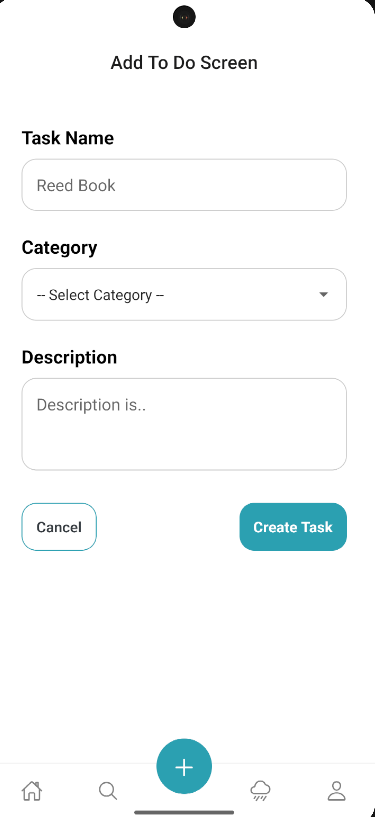
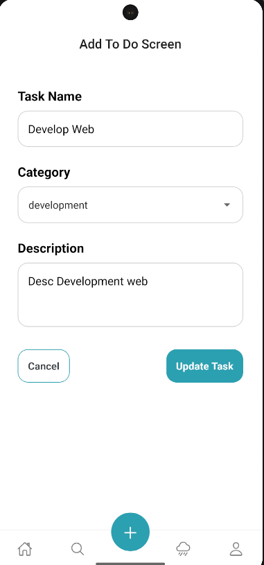
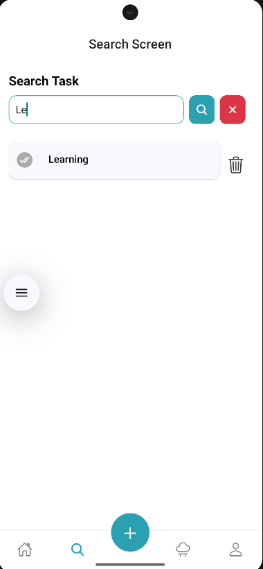

✅Berikut adalah beberapa screen yang telah dibuat

 -> Home page
 -> Detail todolist
 -> Delete Dialog
 -> Add To do
 -> Update To do
 -> Searching to do

🚀 Menjalankan Project React Native
✅ Prasyarat
Pastikan Amda sudah menginstal:

Node.js (disarankan versi LTS, contoh: 18.x)

Yarn atau npm

Watchman (untuk pengguna macOS)

Java Development Kit (JDK) untuk Android (disarankan JDK 11)

Android Studio (untuk emulator Android dan build tools)

Xcode (hanya untuk pengguna macOS jika ingin menjalankan di iOS)

Cocoapods (khusus iOS)

📌 Disarankan menggunakan React Native CLI (bukan Expo) jika proyek ini dibangun dengan React Native CLI.

🛠️ Instalasi
bash
Copy
Edit
# Clone repository
git clone https://github.com/username/project-name.git
cd project-name

# Install dependencies
yarn install
# atau
npm install
▶️ Menjalankan di Android
bash
Copy
Edit
# Jalankan Metro bundler
npx react-native start
Di terminal lain:

bash
Copy
Edit
# Build dan jalankan aplikasi di emulator/device Android
npx react-native run-android
▶️ Menjalankan di iOS (macOS only)
bash
Copy
Edit
# Install pods terlebih dahulu
cd ios && pod install && cd ..

# Jalankan Metro bundler
npx react-native start
Di terminal lain:

bash
Copy
Edit
# Build dan jalankan aplikasi di simulator iOS
npx react-native run-ios
🧯 Troubleshooting Umum
1. ❌ error Failed to install the app. Make sure you have the Android development environment set up.
✅ Solusi:

Pastikan Android emulator sudah berjalan.

Jalankan adb devices untuk memastikan device terdeteksi.

Jalankan ulang Metro bundler: npx react-native start --reset-cache.

2. ❌ Could not resolve all dependencies for configuration...
✅ Solusi:

Coba jalankan:

bash
Copy
Edit
cd android
./gradlew clean
cd ..
npx react-native run-android